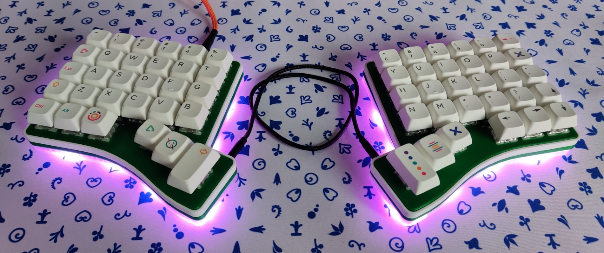
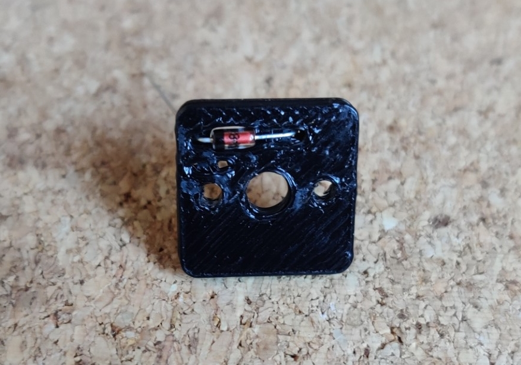
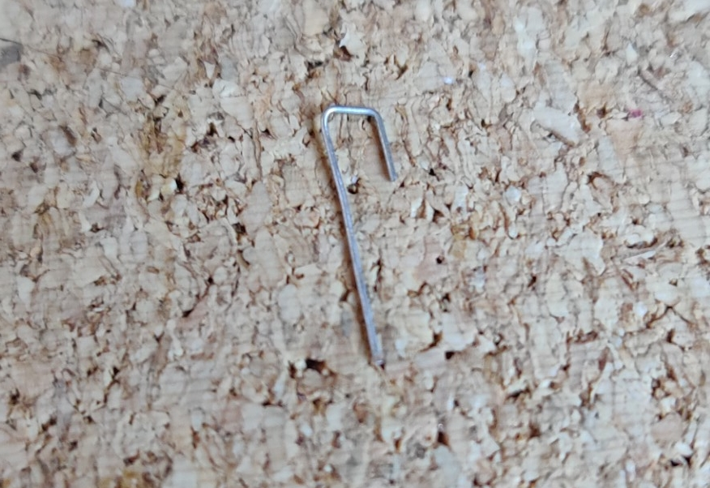
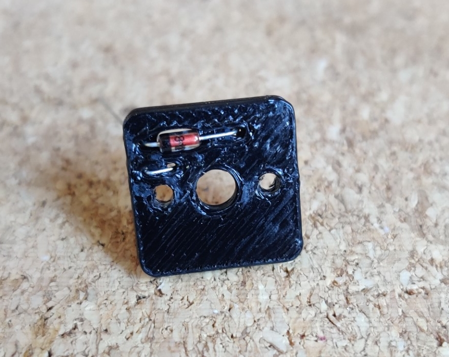
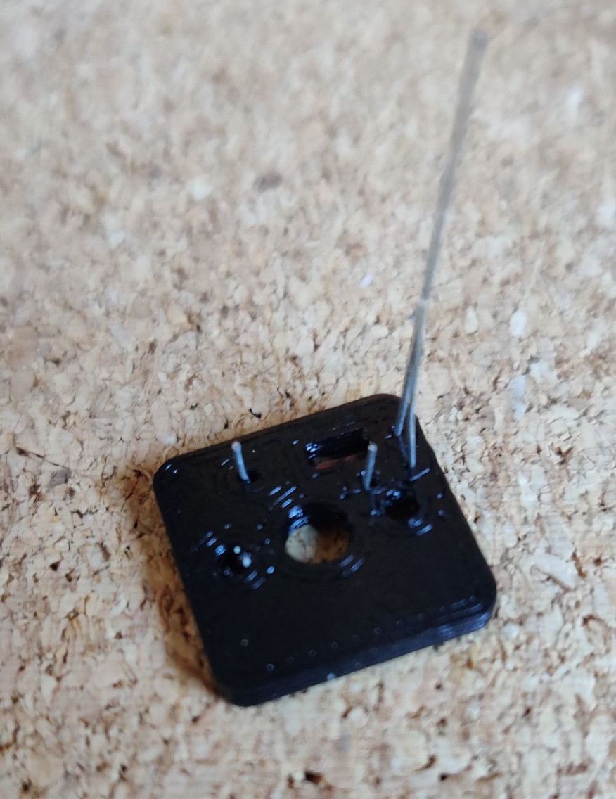
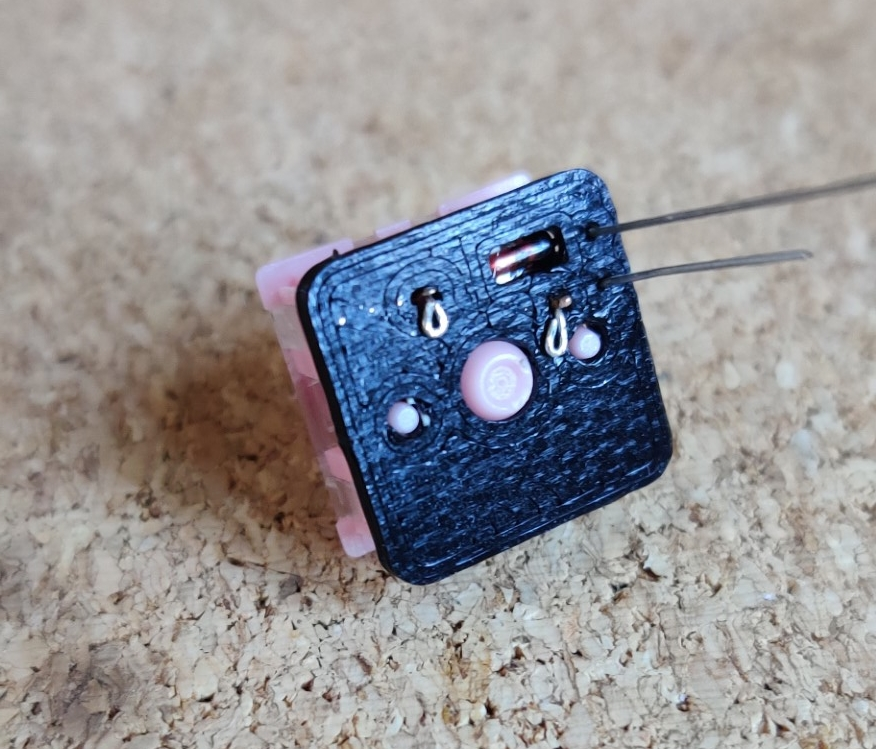
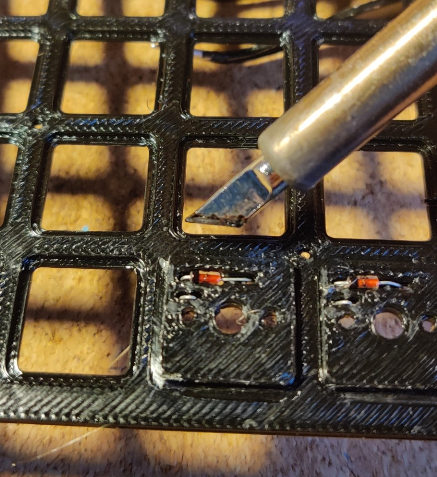
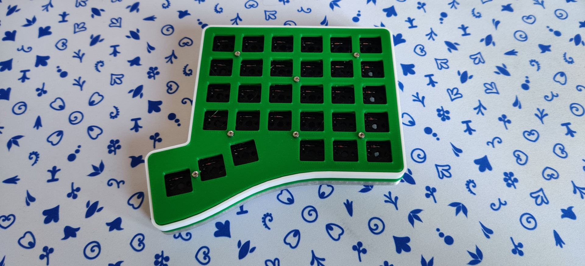

# simplyKeeb S60ph

This folder contains everything to generate, print and build the **simplyKeeb S60ph** (splitted 60 keys, printed hotswap).
The keyboard models are automatically generated out of a few dxf files.  
**It is completely 3D printable! Including the hotswap sockets.**

## Features

- Split 
- 60 Keys with three key thumb clusters
- RGB Backlight
- Completly 3D printable

## Flaws

- No reset button

## FAQ

**Q >** Do you recommend building this keyboard?  
**A >** No! I really love the layout, but the build of the printed hot swaps was a very tedious task! The keyboard is great, if done, but please bear in mind, that it is by no means an enjoyable build!

**Q >** Why do you use individual hotswap sockets that then have to be welded together? Instead of printing the complete hotswap board directly?  
**A >** Because of the tight tolerances of the sockets. By printing them individually you are able to sort out single sockets, if the tolerances of some sockets are not perfect. Otherwise you would be forced to reprint a whole board!

**Q >** To many keys! I just use four! Learn to use layers!  
**A >** I already own and use 36 key keyboards, but I wanted a layout which is useable for any task I face and which is suitable for gaming.

## BOM

- Printed Parts
- 60x Diodes
- 2x Pro Micro
- 2x TRRS
- 2x M3x5mm scews
- 14x M2x12mm screws
- 14x M2x4mm Heat Set Inserts
- LEDs, if you want a backlight

## Prerequisites

This version uses [OpenSCAD](https://openscad.org/) to generate the 3D printable files. Please make sure, that you have installed the latest version. If you want to automatically build all STLs, you should also install *python*.

## Generate and print the models

To generate the 3D models just execute the *build.py* and enter the necessary information.

Before printing all parts, it is advisable to test if the tolerances for the hotswap sockets fit. Simply print one or two of the sockets and build them as described below. If everything fits, the remaining sockets and parts can be printed.

## Build the keyboard

**Please be aware, that I will not describe the full build of the electronics. This chapter only describes parts of the build necessary to understand how the 3D printed parts are meant to be used. If your don't know how to handwire a keyboard, please look into one of the already available great tutorials out there.**

### Hotswap Socket

To build one hotswap socket you need one of the printed sockets and one diode.

1. Bend the legs of the diode and insert it into the upper holes of the socket. 

2. Cut the leg on the right (top view). Not flush to the socket! Leave a bit of the leg like in the picture.

3. Bend the cut leg. Picture for reference.

4. Insert the leg into the bottom holes of the socket. Short end to the right.

5. Insert a switch and bend the short ends to prevent them from slipping out of the holes.

You successfully created a printed hotswap socket! If you want to make sure it works, just take a digital multimeter and test it in diode mode.

### Hotswap Board

In this step the hotswap board will be put together. You need all of your build hotswap sockets, the hotswap boards and an old soldering tip. Insert the hotswap socket into the board, heat up your soldering iron to 240°C and weld the socket and the board together. Repeat this for all sockets.

### Case

Following a few pictures of the remaining build. The remaining parts should be straight forward, if you know how to do a handwired build.

## Using the OpenSCAD files to generate a custom layout

The OpenSCAD models are completly configurable by a few files in the *keeb* folder:

- **plate.dxf** *The plate outline including the switch positions*
- **outline.dxf** *The plate outline without the switch positions*
- **hole.dxf** *The outline of a single switch. This is necessary to generate the right shape for the hotswap sockets.*
- **positions.scad** *Contains the position of the screws, pro micro and trrs (if needed).*

By changing these files, it is possible to create a custom keyboard! For example:

- Head over to the [Keyboard Layout Editor](http://www.keyboard-layout-editor.com/) and create a layout you like. Save the raw data.
- Head over to the [ai03 plate generator](https://kbplate.ai03.com/) and paste the raw data from step one. Download the generated dxf file and save it as **plate.dxf**.  
- Create the *hole.dxf* and *outline.dxf* out of the generated *plate.dxf*. (use *libreCAD* for example)
- Replace the files in the *keeb* folder and change the *positions.scad* to suite your layout
- Run the *build.py* and enjoy your custom layout